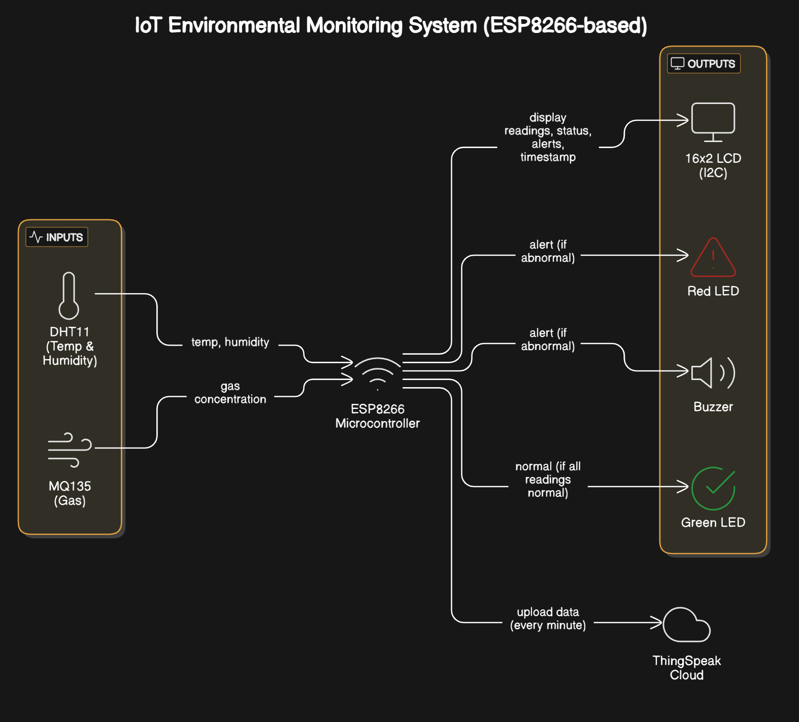
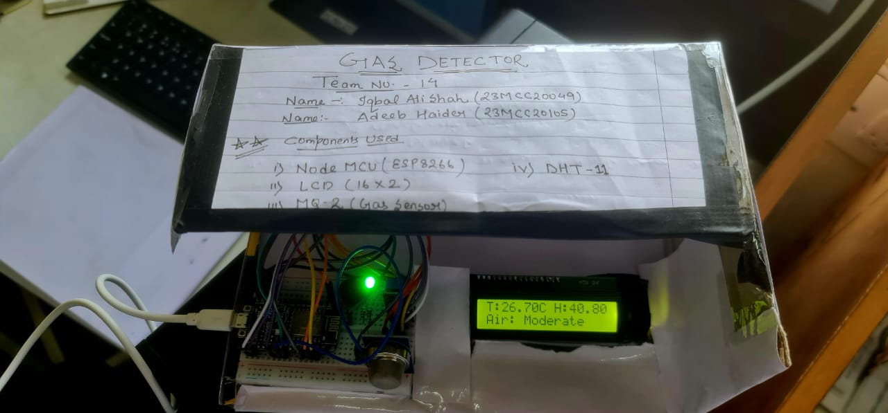
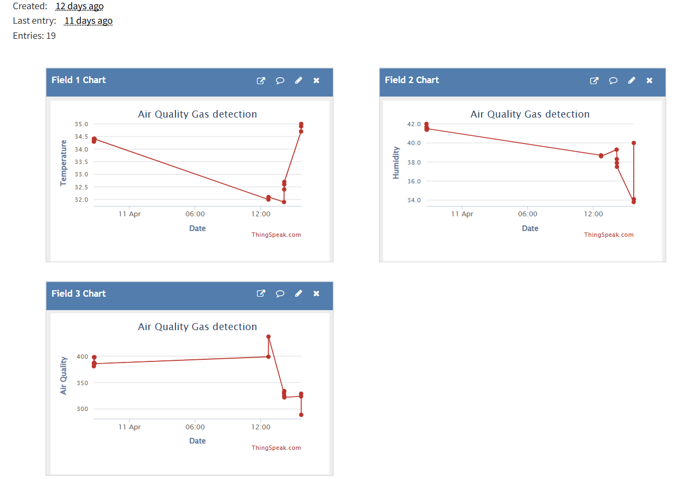

# IoT Environmental Monitoring System  
By 23MCC20049 Iqbal Ali Shah and 23MCC20105 Adeeb Haider.

An IoT-based smart monitoring system using ESP8266, DHT11 (Temp & Humidity), MQ135 (Air Quality), LCD, LEDs, Buzzer, and ThingSpeak for real-time data tracking and alerts.

## Features
- Temperature & humidity sensing  
- Air quality monitoring  
- Real-time alerts with LEDs and buzzer  
- Cloud upload using ThingSpeak  
- LCD display for live readings  

## Hardware
- ESP8266 NodeMCU  
- DHT11 sensor  
- MQ135 gas sensor  
- 16x2 LCD with I2C  
- LEDs and Buzzer  

## Block Diagram

  

  

  

